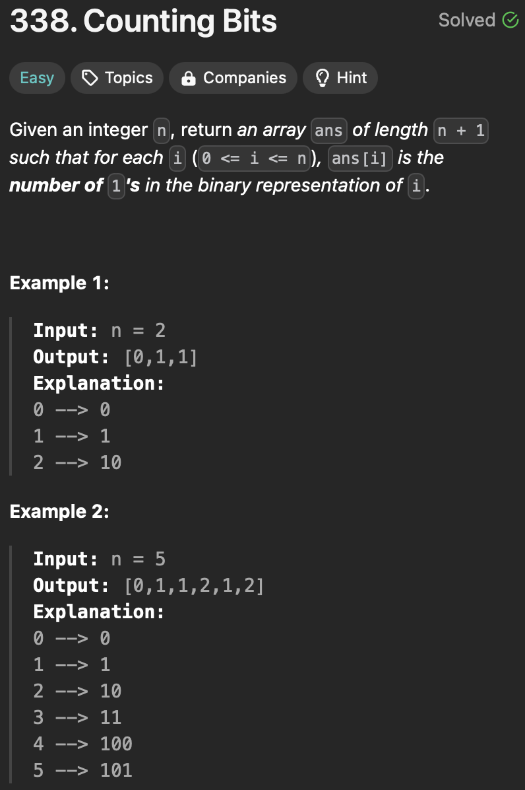

<h3>Approach 01: Bit Manipulation</h3>
Time complexity: O(n * log(n))

https://github.com/GiaKhangLuu/LeetCode/assets/64302789/f52fcf24-0a2e-419a-acf9-ec2da6673522

<h3>Approach 02: Dynamic Programming</h3>
Time complexity: O(n)

https://github.com/GiaKhangLuu/LeetCode/assets/64302789/fbe1a0d3-88f2-470e-9c08-7f4b4bb49406

