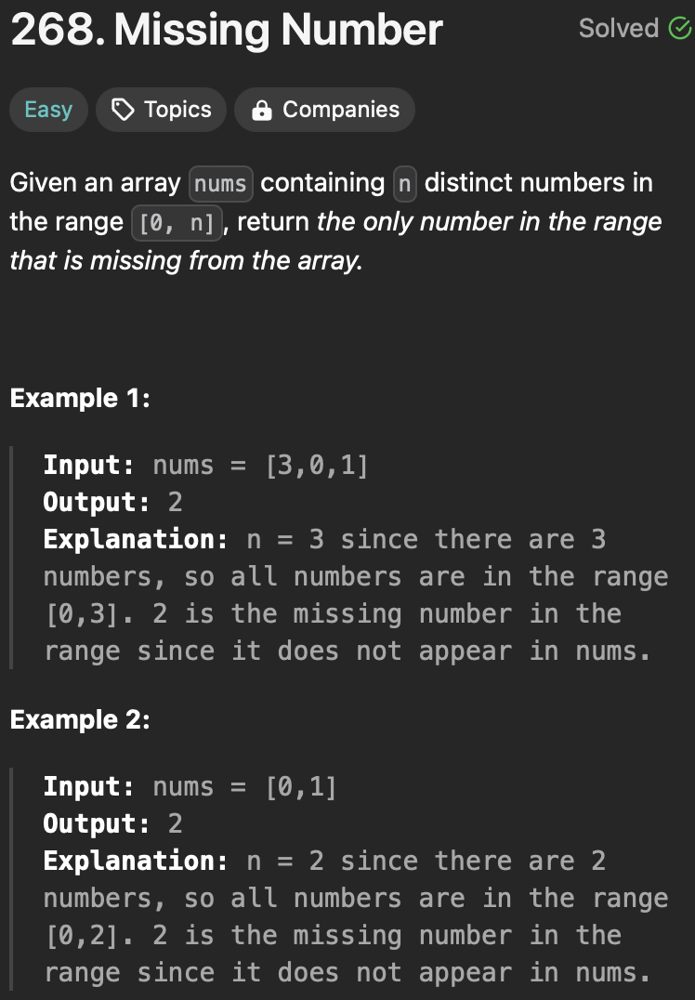

<h3>Approach 01: Bit Manipulation</h3>

https://github.com/GiaKhangLuu/LeetCode/assets/64302789/da75c8a3-7595-46b6-a509-6f39afec7578

<h3>Approach 02: Mathematics</h3>

https://github.com/GiaKhangLuu/LeetCode/assets/64302789/9ca39308-1abf-422e-a1e3-f4779e4d6e4a

