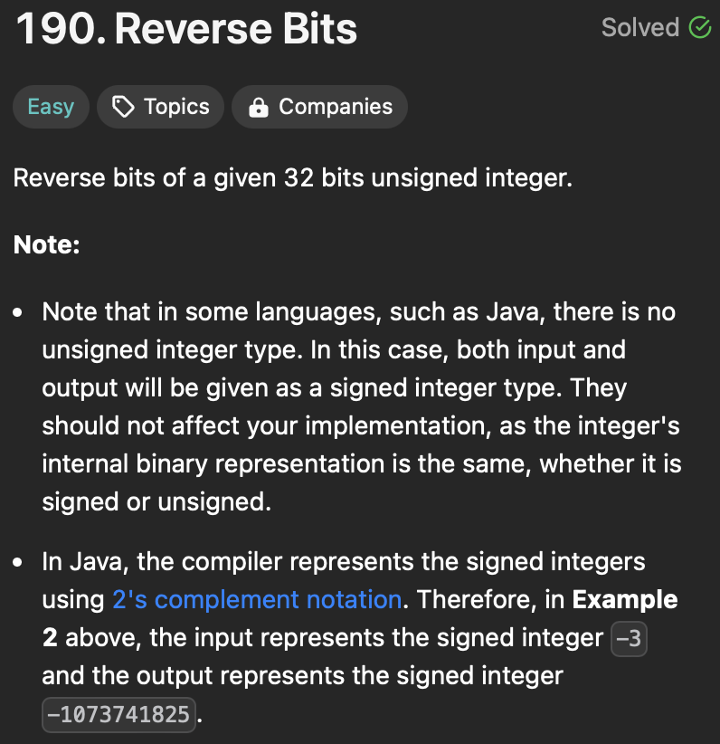
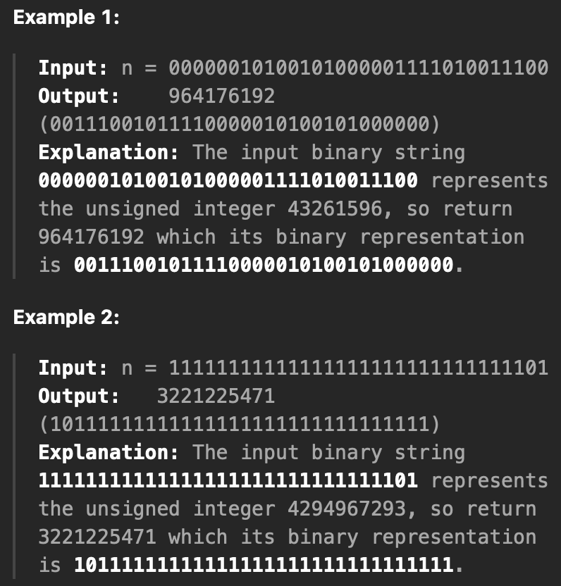

<h3>Khang Version</h3>

https://github.com/GiaKhangLuu/LeetCode/assets/64302789/ef3158bb-7d8f-4abb-9747-dd91ea9ddd3e

<h3>Neetcode</h3>

https://github.com/GiaKhangLuu/LeetCode/assets/64302789/be3738cd-7548-4505-951b-b9e17f69d450

