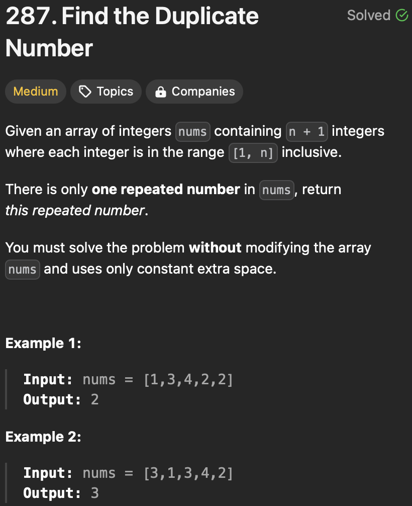

https://github.com/GiaKhangLuu/LeetCode/assets/64302789/35eecfb1-6ebb-49c3-9c92-65b3477f6dec

<h5>Prove that meeting point and starting point will meet at the duplicate number (starting of the cycle) when moving by 1</h5>

https://github.com/GiaKhangLuu/LeetCode/assets/64302789/f900db33-7723-4b23-9847-f9251bef8241

<h3>Reference</h3>

https://www.youtube.com/watch?v=9YTjXqqJEFE
